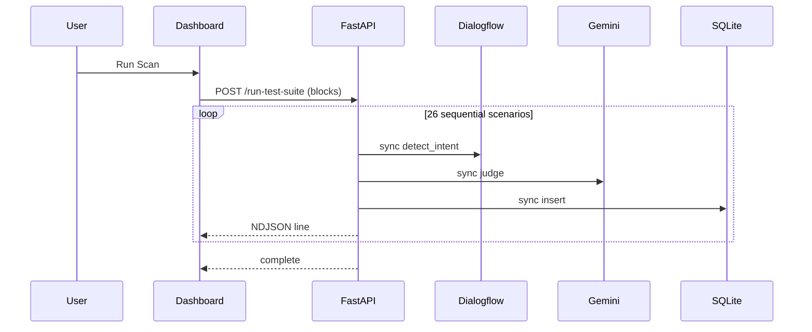
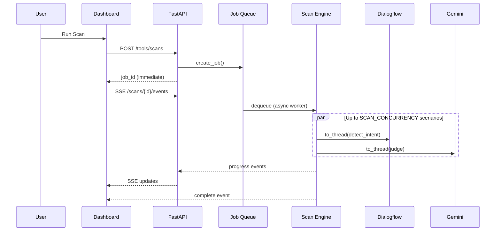

# Agent Sentinel — Architecture Improvements

**Date:** June 22, 2026  
**Purpose:** Document the performance-oriented architecture changes for production deployment on Google Cloud Run.

---

## 1. Before vs After Architecture

### Before



**Problems:**
- Single HTTP request held for entire scan (minutes)
- Event loop blocked on sync gRPC/LLM calls
- No parallelism across independent scenarios
- Cloud Run concurrency wasted on one user

### After



---

## 2. New Components

### 2.1 Scan Engine (`tools/scan_engine.py`)

Central orchestrator for red-team test execution.

**Responsibilities:**
- Load scenarios (static cache or dynamic generation)
- Execute scenarios in parallel with bounded concurrency
- Emit structured progress events
- Score responses (with cache lookup)
- Persist results and compute release score

**Key design decisions:**
- `asyncio.Semaphore(SCAN_CONCURRENCY)` prevents API rate-limit storms
- `asyncio.to_thread()` isolates blocking Dialogflow/Gemini/SQLite from the event loop
- Thread-local tool call tracker supports parallel scenarios safely

### 2.2 Job Queue (`tools/job_queue.py`)

In-process async job queue with event broadcasting.

**API surface:**
| Endpoint | Method | Purpose |
|----------|--------|---------|
| `/tools/scans` | POST | Create job, return immediately |
| `/tools/scans/{id}` | GET | Poll job status |
| `/tools/scans/{id}/events` | GET (SSE) | Stream progress |
| `/tools/run-test-suite` | POST | Legacy NDJSON stream (uses same engine) |

**Event types:**
```json
{"status": "processing", "agent": "Jailbreaker", "agents_completed": ["Jailbreaker"]}
{"status": "agent_completed", "agent": "PII Sniffer", "message": "✓ PII Sniffer completed"}
{"status": "test_completed", "verdict": "pass", "scenario_id": "pi_001"}
{"status": "complete", "release_score": {...}}
```

**Scaling note:** For multi-instance Cloud Run, set `REDIS_URL` to externalize job state. Current implementation is optimized for single-instance or low-traffic deployments.

### 2.3 Cache Layer (`tools/cache.py`)

Redis-compatible interface with in-memory LRU fallback.

**Cached data:**
| Key pattern | TTL | Purpose |
|-------------|-----|---------|
| `eval:{sha256}` | 7200s | Gemini judge results for identical prompt+response |
| Scenario cache (in-process) | Process lifetime | Static JSON scenarios |

**Upgrade path:** Set `REDIS_URL=redis://...` for shared cache across Cloud Run instances.

---

## 3. Client Lifecycle Management

### Dialogflow CX
- `SessionsClient` cached per regional endpoint (`@lru_cache`)
- Retry policy for transient gRPC errors
- Configurable timeout (`DIALOGFLOW_TIMEOUT_SECONDS`)

### Gemini / Vertex AI
- Single `GenerativeModel` instance per process
- One-time `vertexai.init()` for ADC path
- Eval timeout with heuristic fallback

### HTTP (httpx)
- Shared async client for Phoenix REST fallbacks
- Shared sync client for Agent Builder webhook tools

### Phoenix
- Singleton Python client
- Batched eval dataset writes (configurable batch size)
- Local trace cache checked before expensive dataframe queries

### SQLite
- Thread-local connection reuse
- WAL mode + `synchronous=NORMAL`
- Indexes on `evaluations(timestamp)`, `evaluations(category)`, `approvals(status)`

---

## 4. Startup Initialization (Moved Off Request Path)

Executed in FastAPI `lifespan` before serving traffic:

1. Phoenix OTEL registration + VertexAI instrumentor
2. Scenario JSON preload into memory cache
3. Job queue worker start
4. (Implicit) Dialogflow/Gemini clients initialized on first use

**Cloud Run alignment:**
- `startup-cpu-boost: true` — faster cold start
- `minScale: 1` — warm instance avoids repeat cold starts
- Health check at `/health` — startup probe target

---

## 5. Frontend Real-Time UX

### Scan flow
1. User clicks **Run Safety Tests**
2. `POST /tools/scans` → receives `job_id` + `events_url`
3. `EventSource` connects to SSE stream
4. Progress modal shows:
   - Progress bar (index/total)
   - Active agent badge
   - **Agent checklist** (✓ completed, ⏳ running)
   - Terminal log (append-only DOM)
5. Results table grows incrementally (`appendEvalRow`)
6. On complete → refresh stats once

### Fallback
If SSE fails, dashboard falls back to legacy NDJSON `POST /run-test-suite`.

### Dashboard polling
- **15s interval** (was 5s)
- **Paused during active scans**
- **Skipped when tab hidden** (`document.hidden`)
- **Parallel fetches** via `Promise.all`

---

## 6. Cloud Run Configuration

See `deploy/cloudrun-service.yaml` for the full manifest.

| Parameter | Recommended | Why |
|-----------|-------------|-----|
| CPU | 2 | Parallel thread pool for 4 concurrent API calls |
| Memory | 2Gi | pandas/Phoenix client + scenario data |
| Concurrency | 80 | Async I/O; most requests are short |
| minScale | 1 | Eliminate cold start for demo/production |
| maxScale | 10 | Cost cap; scale on concurrent users |
| timeout | 3600s | Background jobs may run long; SSE stays open |

**Deploy command:**
```bash
gcloud run deploy agent-sentinel \
  --source . \
  --region us-central1 \
  --cpu 2 \
  --memory 2Gi \
  --min-instances 1 \
  --concurrency 80 \
  --timeout 3600 \
  --set-env-vars SCAN_CONCURRENCY=4,PHOENIX_EVAL_BATCH_SIZE=5
```

---

## 7. Observability Strategy

### Span reduction
- **Before:** 1 CHAIN + 1 LLM + N TOOL spans per scenario
- **After:** 1 CHAIN span with tool metadata attributes

### Trace lookup priority
1. Local in-process cache (populated during scan)
2. Phoenix Cloud API (thread-pooled, not on event loop)

### What we kept
- VertexAI auto-instrumentation for Gemini judge calls
- End-of-scan OTEL flush for serverless export
- OpenInference span kind attributes on scenario spans

---

## 8. What We Deliberately Did NOT Add

| Excluded | Reason |
|----------|--------|
| **Load balancer** | Cloud Run provides LB; no proven bottleneck |
| **Celery/RQ worker fleet** | In-process async queue sufficient for current scale; Redis upgrade path documented |
| **Multi-worker uvicorn** | Breaks in-memory job queue; use Cloud Run horizontal scaling instead |
| **React rewrite** | Out of scope; vanilla JS optimized in place |

---

## 9. Future Recommendations (Ordered)

1. **Redis job store** — Enable multi-instance Cloud Run with shared job queue
2. **Cloud SQL / Firestore** — Replace ephemeral SQLite for persistent eval history
3. **Phoenix trace query API filter** — Server-side trace_id filter instead of full dataframe
4. **Vite build pipeline** — Minify dashboard assets, subset Font Awesome
5. **React migration** — If planned per `task.md`, use `React.lazy` + TanStack Query
6. **Adaptive concurrency** — Auto-tune `SCAN_CONCURRENCY` based on error rates / latency

---

## 10. Migration Guide

### For API consumers (Agent Builder)
- **No breaking changes** — `/tools/run-test-suite` still works
- New optional flow: `/tools/scans` + SSE for faster perceived response

### Environment variables to add
```env
SCAN_CONCURRENCY=4
DIALOGFLOW_TIMEOUT_SECONDS=45
GEMINI_TIMEOUT_SECONDS=30
PHOENIX_EVAL_BATCH_SIZE=5
EVAL_CACHE_TTL_SECONDS=7200
# REDIS_URL=redis://...  # optional
```

### Rollback
Revert to sequential scan by setting `SCAN_CONCURRENCY=1`. Job queue can be bypassed by using `/run-test-suite` directly.

---

## 11. Security & Reliability Notes

- Dialogflow timeouts prevent hung scenarios from blocking the worker indefinitely
- Gemini eval timeout falls back to deterministic heuristics
- Job queue evicts oldest completed jobs when >100 stored
- SSE includes heartbeat comments every 30s to keep connections alive through proxies

---

*See [PERFORMANCE_REPORT.md](./PERFORMANCE_REPORT.md) for detailed bottleneck analysis and expected gain per fix.*
